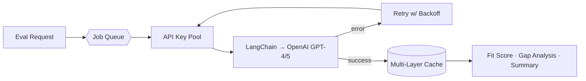
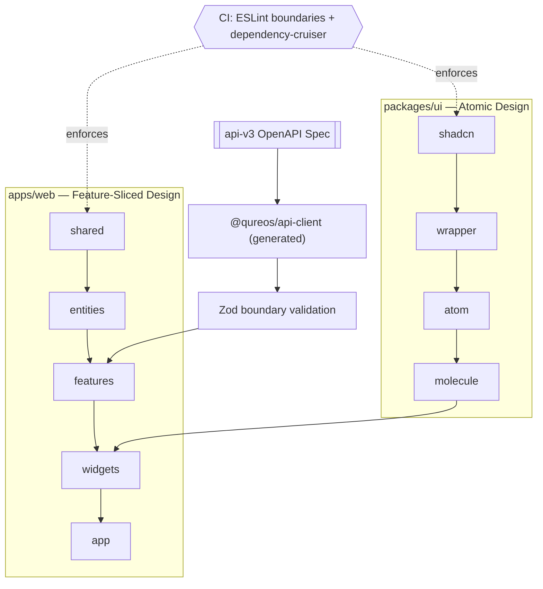

<div align="center">


<a href="https://linkedin.com/in/mohd-faizan"></a>
<a href="mailto:faizanmohiuddin.dev@gmail.com"></a>


</div>

```bash
$ whoami
faizan — senior full-stack engineer, building production AI infra & frontend platforms

$ cat philosophy.txt
Measure everything. Never guess when you can profile.
Architecture is a decision you make once and pay for forever — so make it deliberately.

$ ls ./currently/
architecting qureos-frontend/    shipping vargo.in/    open to Senior Frontend/Full-Stack roles/
```

<br/>

## 🏗️ Systems I've Actually Built

Not "I know React" — here's the real shape of two systems I designed and shipped in production.

<table>
<tr><td>

**Production LLM Evaluation Pipeline** (Qureos) — sustains 20+ concurrent AI evaluation jobs, zero downtime.



</td></tr>
<tr><td>

**Greenfield Frontend Platform** (`qureos-frontend`) — dual-axis architecture, CI-enforced boundaries so it can't decay back into the "mix of components" it replaced.



</td></tr>
</table>

<br/>

## 📈 Case Studies, Not Claims

<table>
<tr><td width="33%" valign="top">

**46% smaller, 25% faster**
<br/><br/>
*Problem:* app was shipping bloated bundles, slow first paint.
<br/>
*Approach:* led a system-wide audit — code-splitting, dependency pruning, targeted refactors.
<br/>
*Result:* 46% smaller bundle, 25% faster overall performance, org-wide.

</td><td width="33%" valign="top">

**20+ concurrent jobs, 0 downtime**
<br/><br/>
*Problem:* AI evaluation jobs bottlenecked on rate limits and flaky calls.
<br/>
*Approach:* architected API key pooling, retry logic, multi-layer caching, queue-based processing.
<br/>
*Result:* sustained 20+ concurrent jobs with zero downtime.

</td><td width="33%" valign="top">

**Architecture that can't decay**
<br/><br/>
*Problem:* legacy frontend was an unstructured "mix of components."
<br/>
*Approach:* authored ADRs for a two-axis structure (FSD + Atomic Design), enforced via CI dependency rules.
<br/>
*Result:* boundary violations fail the build — decay is structurally prevented, not just discouraged.

</td></tr>
</table>

<br/>

## 🧰 Skill Matrix

**Daily driver, production:** `React` `Next.js` `TypeScript` `Node.js` `Tailwind CSS` `HTML5/CSS3`
<br/>
**Also shipped with:** `Python` `LangChain` `OpenAI API` `AWS` `GCP` `Firebase` `PostgreSQL` `MongoDB` `Electron`

<div align="center">

<br/>
<br/>


</div>

<br/>

## 🚀 Shipped Solo, End-to-End

| Product | What it is | Live |
|---|---|---|
| **Vargo Logistics** | Multi-tenant logistics SaaS — Shopify integration, prepaid wallet | [vargo.in](https://vargo.in) |
| **FetchMate** | Privacy-first offline API client — Electron + browser ext + VS Code ext | [fetchmate.vercel.app](https://fetchmate.vercel.app) |
| **bullpen** ⭐ open source | Skills that make AI coding agents behave like senior engineers | [demo](https://faizanmohiuddin482.github.io/bullpen/) · [source](https://github.com/faizanmohiuddin482/bullpen) |
| **Memoria** | AI memory assistant — NL storage, semantic search via pgvector | [altmemoria.netlify.app](https://altmemoria.netlify.app) |

<br/>

## 📊 GitHub Activity

<div align="center">


</div>

<div align="center">

</div>

<br/>

<div align="center">

</div>
